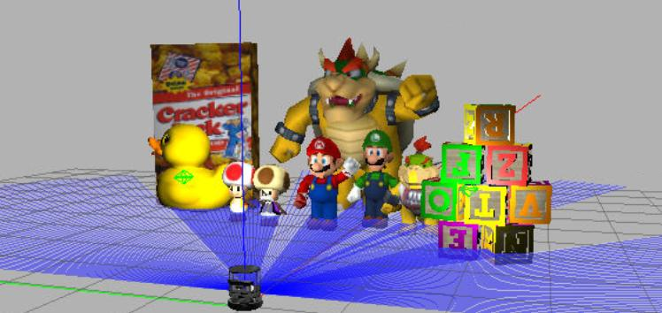
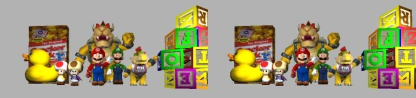
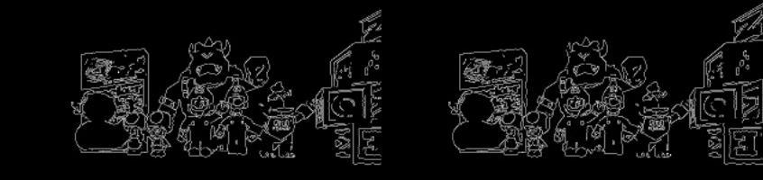
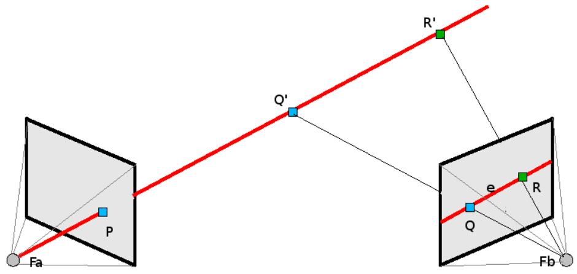
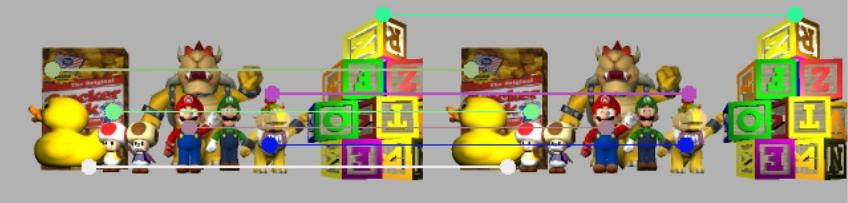
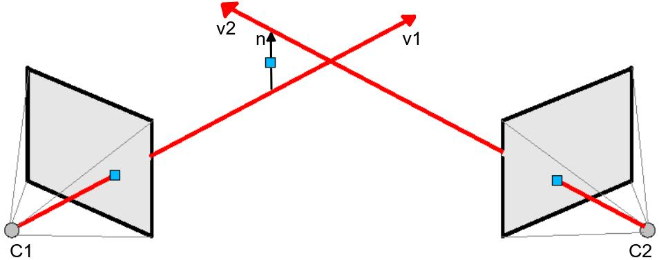
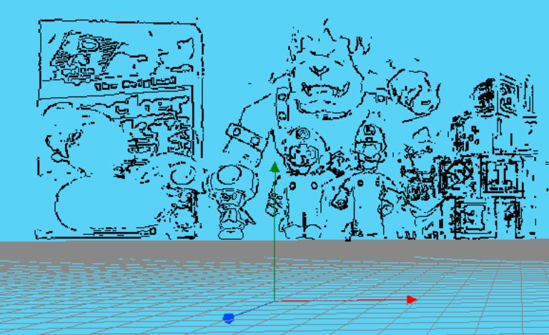
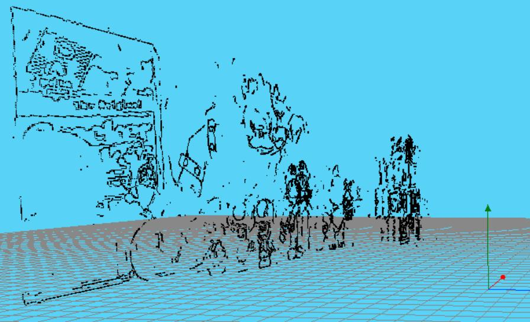
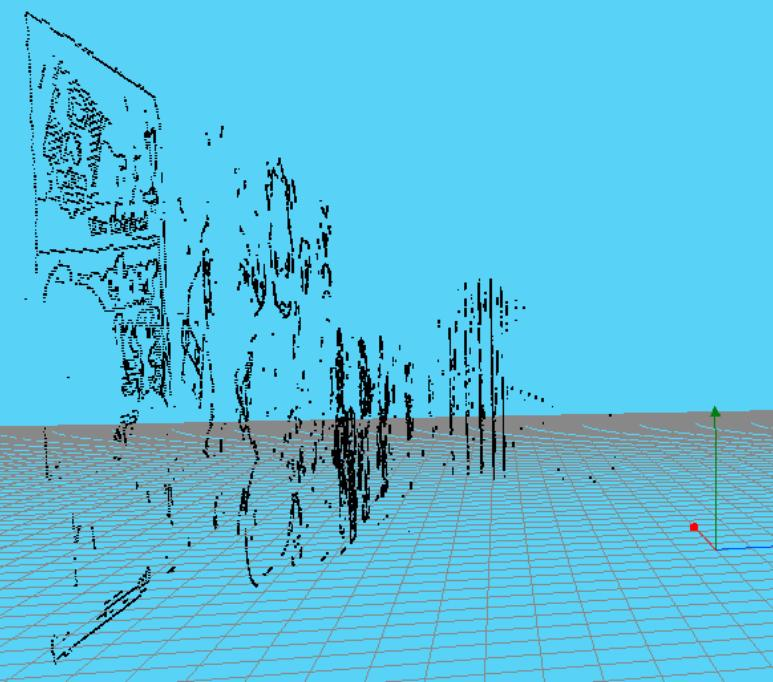

# Welcome to Robotic Vision subject

This blog is about Robotic Vision subject of the Artificial Vision máster of the [Rey Juan Carlos University](http://www.urjc.es) of Madrid. In this website I will be narrating my progress in this subject.

by Juan Luis Carrillo

Specifically, the following exercises have been carried out:
- [Follow Line exersice of Unibiotics platform](#p1)
- [3D Reconstruction](#p2)

## <a name="p2" />3D Reconstruction

In this practice, the [3D Reconstruction](https://jderobot.github.io/RoboticsAcademy/exercises/ComputerVision/3d_reconstruction) exercise of the Robotics-Academy website will be carried out. Specifically, the 3D scene shown below will be reconstructed.

This scene will be reconstructed from the following images.

To achieve the objective, the following steps have been followed:
- Perform a Canny filter
- Calculate the epipolar line
- Obtain the homologous points of the two images
- Calculate 3D point from homologous 2D points

_Perform a Canny filter_

The first step has been to apply a Canny filter to the images of the stereo pair, as shown in the following figure.

This filter has a pair of parameters, threshold1 and threshold2. Modifying these parameters can appear more or less edges in the image. The homologous points will be searched on the points that make up the edges of the filtered image with the Canny algorithm.

_Calculate the epipolar line_

Thanks to the simulator API, the point R 'will be obtained from a point of the left camera (see figure). The midpoint, Q', between that point and the center of the camera is then calculated.

Projecting these two points on the right camera the points R and Q are obtained. These points allow the calculation of the epipolar line equation.

_Obtain the homologous points of the two images_

Starting from a point of interest in the left image, the homologous point in the right image is searched by traversing the previously calculated epipolar line. To alleviate precision errors, homologous points are also searched on the upper and lower lines parallel to the epipolar line.

The following figure shows some homologous points in the stereo pair.

_Calculate 3D point from homologous 2D points_

From the two homologous 2D points and using the simulator API the corresponding 3D points are obtained. With these and the centers of the cameras, the vectors v1 and v2 can be calculated.

The 3D point can be calculated by solving the following system equations:

Where, n vector is:

Finally, the 3D point will be

__Results__

The following figures show the result of the 3D construction from different points of view.

The following video shows the results.

-----

## <a name="p1" /> Follow Line exersice of Unibiotics platform 

The goal of [Follow Line](https://unibotics.org/academy/exercise/follow_line/) exercise is to perform a PID reactive control capable of following the line painted on the racing circuit.

To perform the exercise it is necesary to previously do:
1. Pull the latest RADI image from Docker using the following command: docker pull jderobot/robotics-academy
2. Start the Docker container of the image and keep it running in the background (replace "container_name" with a name of your preference): `docker run -it --name=container_name -p 8080:8080 -p 7681:7681 -p 2303:2303 -p 1905:1905 -p 8765:8765 jderobot/robotics-academy` (In case you've already had the container just run docker run "container_name")
3. Click the connection button and wait until it turns green.
4. Now you can use the exercise!

Then, I program the code using Python language. I use a **PD controller**. After many trials to adjust the controller parameters, a lap is completed in just over 30 seconds. For this solution, it is very important that the **Brain parameter is 30**. Otherwise, the car would be very unstable.

This video shows the result.

